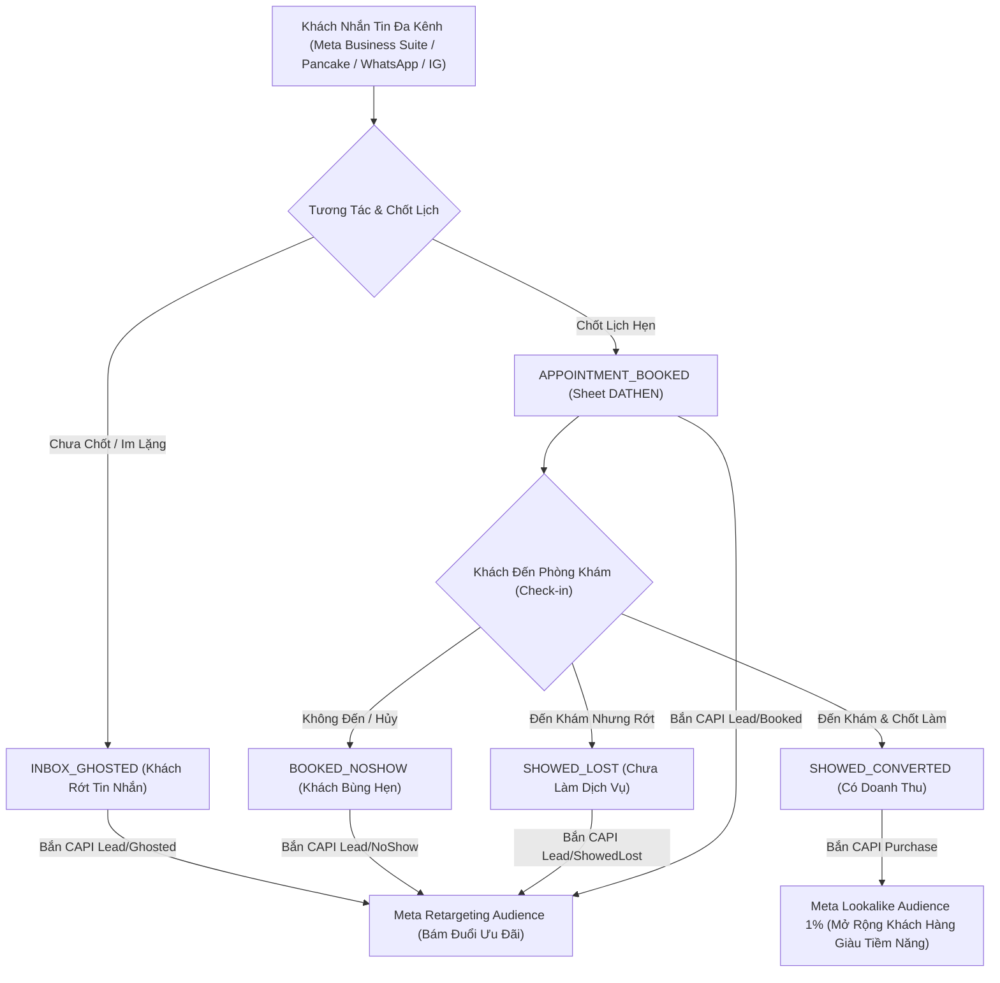

# Clinic CRM & Multi-Channel CAPI Retargeting Reference Guide

## 1. Customer Funnel Lifecycle Architecture

---

## 2. Funnel Stage to Meta CAPI Mapping Matrix

| Funnel Stage Code | Description | Meta Event Name | Action Source | Custom Data Parameters | Meta Optimization Target |
| --- | --- | --- | --- | --- | --- |
| `SHOWED_CONVERTED` | Khách tới khám & Đã thanh toán dịch vụ | `Purchase` | `physical_store` | `value`, `currency: "VND"`, `content_name`, `contents` | **Lookalike Audience 1% - 3%** (Tối ưu tìm khách mới) |
| `APPOINTMENT_BOOKED` | Khách đã chốt lịch hẹn (Sheet `DATHEN`) | `Lead` | `system_generated` | `lead_type: "AppointmentBooked"`, `branch` | **Custom Audience Retargeting** (Nhắc lịch & Giữ chân) |
| `SHOWED_LOST` | Khách tới khám nhưng RỚT / Chưa chốt | `Lead` | `physical_store` | `lead_type: "ShowedLost"`, `reason`, `branch` | **High-Intent Retargeting** (Bám đuổi voucher/khuyến mãi) |
| `INBOX_GHOSTED` | Khách nhắn tin Messenger/IG nhưng im lặng | `Lead` | `chat` | `lead_type: "InboxGhosted"`, `channel` | **Broad Retargeting** (Tái khởi động hội thoại) |

---

## 3. Pancake CRM & Meta Business Suite Integration Engine

### Pancake POS / CRM Webhook Data Contract
When a tag or order status is updated in Pancake POS:
- `customer.phone` ➔ Normalized E.164 `84...` ➔ SHA-256 Hashed
- `customer.name` ➔ Split into `fn` (First Name) and `ln` (Last Name) ➔ SHA-256 Hashed
- `order.total_price` ➔ Mapped to CAPI `custom_data.value`
- `order.status` ➔ Mapped to Funnel Stage (`SHOWED_CONVERTED` vs `SHOWED_LOST`)

### Meta Business Suite Inbox Integration
- `sender.id` ➔ Mapped to `user_data.page_scoped_user_id`
- `thread.channel` ➔ Mapped to `custom_data.channel` (`facebook_page`, `instagram_direct`, `whatsapp`)

---

## 4. Key Performance Indicators (KPIs) & Analytics Formulas

1. **Inbox to Appointment Rate (%)**:
   $$\text{Booked Rate} = \frac{\text{Total Appointment Booked}}{\text{Total Inbox Leads}} \times 100\%$$

2. **Show-up Rate (%)**:
   $$\text{Show-up Rate} = \frac{\text{Total Showed Up Patients}}{\text{Total Appointment Booked}} \times 100\%$$

3. **Service Conversion Rate (%)**:
   $$\text{Conversion Rate} = \frac{\text{Total Showed Converted Patients}}{\text{Total Showed Up Patients}} \times 100\%$$

4. **Cost Per Booked Appointment (CPB)**:
   $$\text{CPB} = \frac{\text{Total Ad Spend}}{\text{Total Appointment Booked}}$$

5. **Customer Acquisition Cost (CAC)**:
   $$\text{CAC} = \frac{\text{Total Ad Spend}}{\text{Total Converted Patients}}$$
