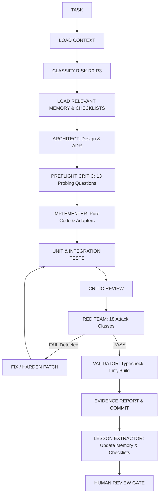

# LƯỜI OS — Agent Engineering Graph

> **Overview**: Logical and execution flow diagram of the autonomous engineering harness.

---

---

## Stage Descriptions

1. **Architect Stage**: Evaluates boundaries, repository contracts, and database schema impact. Produces ADR if R2/R3.
2. **Preflight Critic Stage**: Questions assumptions, identifies client-controlled parameters, tests threat models.
3. **Implementer Stage**: Writes clean, typed code adhering to repository patterns and pure domain logic.
4. **Critic Stage**: Reviews diffs for anti-patterns, unused imports, or layer violations.
5. **Red Team Stage**: Actively attempts identity spoofing, IDOR, stolen session reuse, race conditions, and rule bypasses.
6. **Validator Stage**: Executes `tsc`, `lint`, test suites, and Next.js production builds.
7. **Lesson Extractor Stage**: Encodes fixes into permanent institutional memory (`ai-workspace/memory/`).
